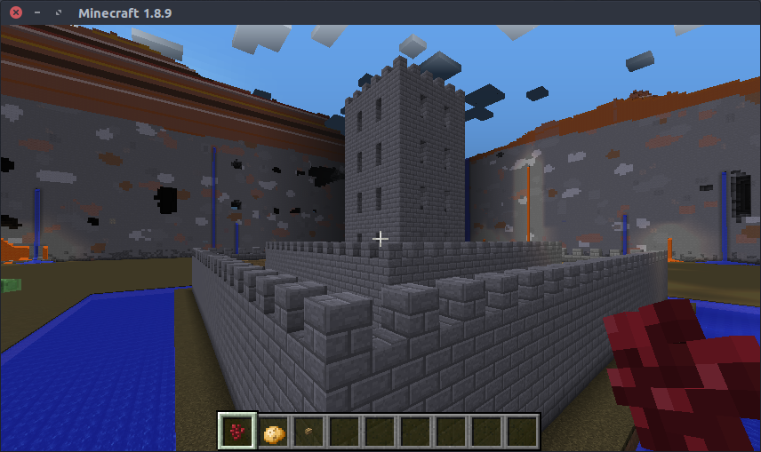

Guide to Examples
=================

All examples are in the ``/examples/`` folder.

Hello World
+++++++++++

``hello_world.py`` — Your standard hello world in the console. Great to test if your api setup is working. ☺

Tower
+++++

``tower.py`` & ``tower_random.py`` — Demonstrates a basic for-loop and block-placement.

.. image:: _static/img/tower.png

OO Castle
+++++++++

``oo_castle.py`` — A castle built using python classes. Will set player pos to the castle's drawbridge.

