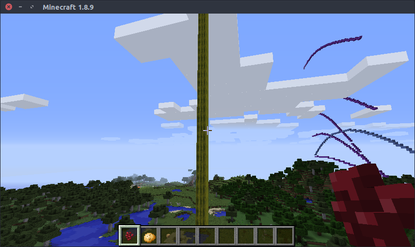

Guide to Examples
=================

All examples are in the ``/examples/`` folder.

* ``hello_world.py`` — Your standard hello world in the console. Great to test if your api setup is working. ☺
* ``tower.py`` & ``tower_random.py`` — Demonstrates a basic for-loop and block-placement.
