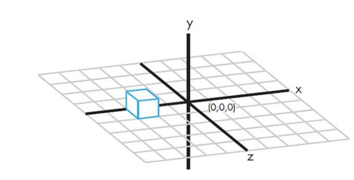

Minecraft Python Presentation Outline for SLCPython March 2016
==============================================================

Installation
------------

Ensure you've created a virtualenv and installed the requirements.

* :doc:`java_installation`
* :doc:`mc_buildtools`

Start er up!
------------

* Start your server: ``inv start_server``
* Start your client: ``java -jar Minecraft.jar``

In the client, connect to multiplayer, and connect to the server ip: ``127.0.0.1``

Test it
-------

Run ``python examples/hello_world.py``

Play Around
-----------

Run ``ipython`` and import the minecraft api:

.. code-block:: python

  from mcpi.minecraft import Minecraft; mc = Minecraft.create()

``ipython`` is awesome because you can start writing some code, and then hit
tab to see what functions are available in that module. You can also use ``help(<module>)`` to see more details about the module (Use ``q`` to quit).

PYTHON!
-------

Modules or: Why write the same code twice?
++++++++++++++++++++++++++++++++++++++++++

Your fellow pythonistas have probably already solved the problem your trying to solve. Or at least something similar.
Rather than copying all of their code, or keeping all code in one file, you can import it with the ``from`` and ``import`` keywords.

Once you've imported, you can write ``help(<imported module>)`` to see the many functions of that code.

Our main import is ``mcpi`` but we don't want to import the whole library and all of its functions, so we use ``from`` to help specify exactly what we're importing. If we want to import as a different word, we can use the ``as`` keyword:

.. code-block:: python

    from mcpi.minecraft import Minecraft
    import mcpi.blocks as blocks

.. note:: We will be using 3D coordinates to place our blocks, (x, y, z). Here's a quick refresher:

Examples
********

* ``hello_world.py``

Loops
+++++

Loops are more than just a way to repeat something, they're also a way to dig through a list of things.
In our tower examples, we use loops for both height and for digging through a list of color blocks.

Examples
********

* ``tower.py``
* ``random_tower.py``
* ``rainbow_tower.py``

Functions
+++++++++

Functions are a great way of capturing a set of commands so you don't have to repeat yourself over and over (let the code do that!). In our previous example, the tower code was pretty much doing the same thing, but what if we just wanted to change it just a little without re-writing all of that code? That's where functions come in.

"Parameters" are the new variables we feed into the function so we don't have to repeat ourselves.

Examples
********

* ``functional_tower.py``

Classes (Advanced)
++++++++++++++++++

Examples
********

* ``oo_castle.py``
